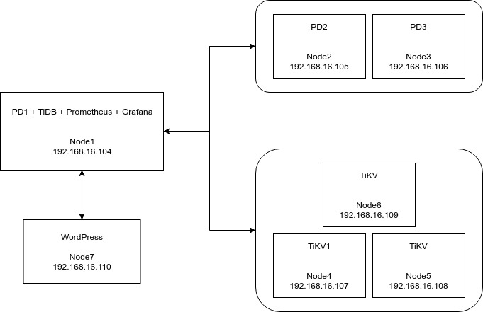
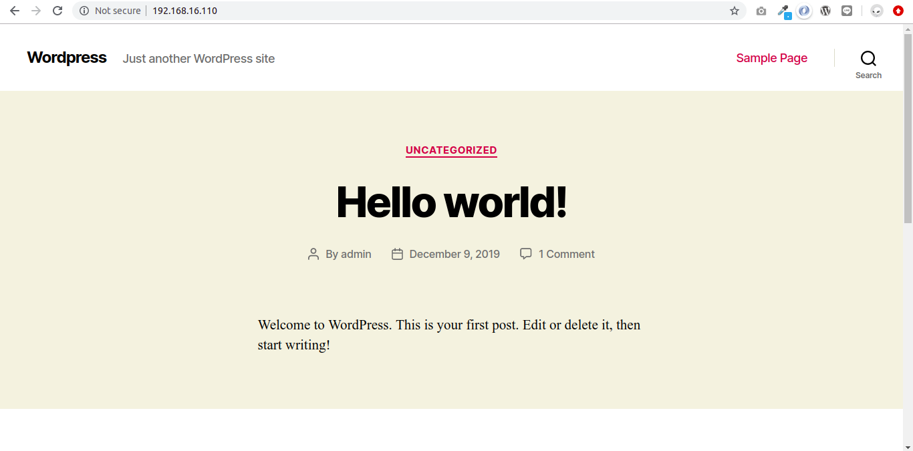
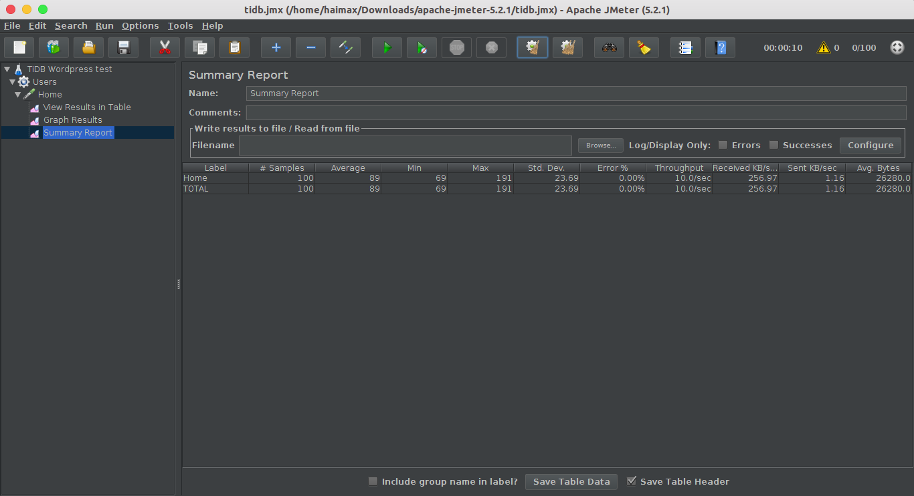
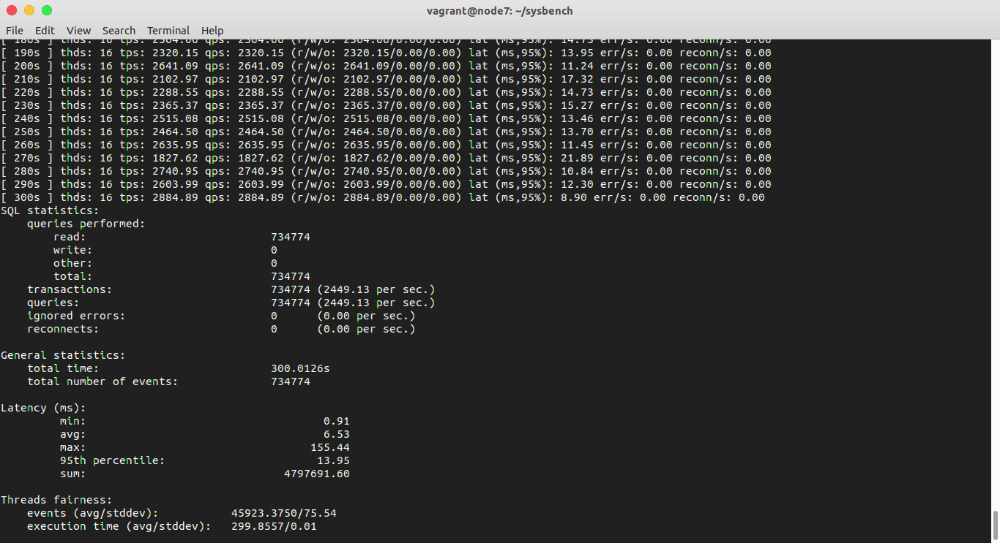
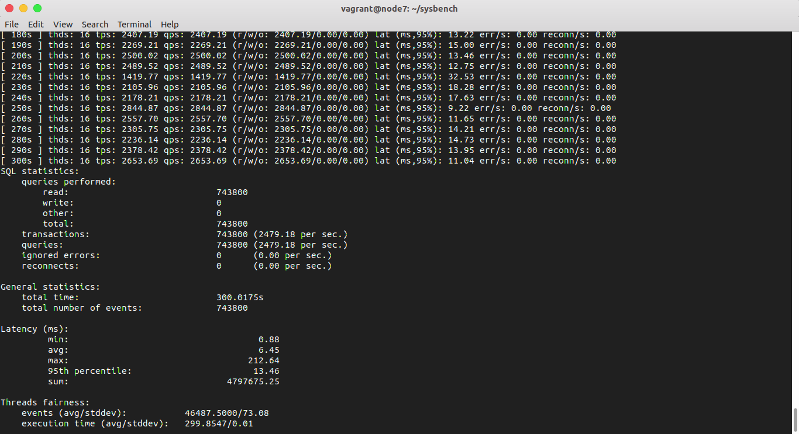
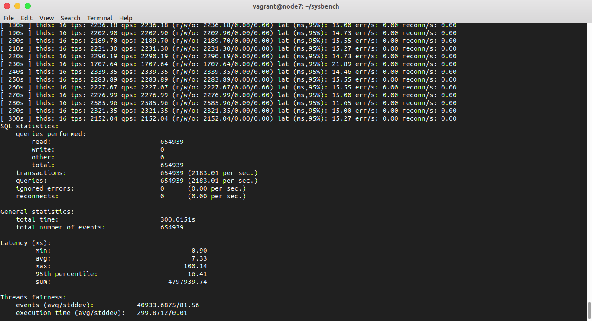
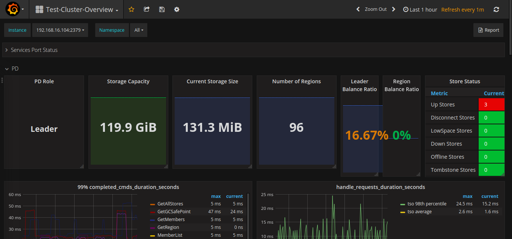

# Distributed Database: TiDB
Distributed database implementation using TiDB.

## Architecture



## Installation

### Prerequisites

- Vagrant ([Download here](https://www.vagrantup.com/))
- Ubuntu vagrant box ([ubuntu/xenial64](https://app.vagrantup.com/ubuntu/boxes/xenial64))

### Usage

- Running Application

    ```
    vagrant up
    ```

- Stopping Application

    ```
    vagrant halt
    ```

## Configuration Step

### PD Server
- Jalankan PD Server pada node1
    ```
    ./bin/pd-server --name=pd1 \
                    --data-dir=pd \
                    --client-urls="http://192.168.16.104:2379" \
                    --peer-urls="http://192.168.16.104:2380" \
                    --initial-cluster="pd1=http://192.168.16.104:2380" \
                    --log-file=pd.log &
    ```

- Jalankan PD Server pada node2
    ```
    ./bin/pd-server --name=pd2 \
                    --data-dir=pd \
                    --client-urls="http://192.168.16.105:2379" \
                    --peer-urls="http://192.168.16.105:2380" \
                    --join="http://192.168.16.104:2379" \
                    --log-file=pd.log &
    ```

- Jalankan PD Server pada node3
    ```
    ./bin/pd-server --name=pd3 \
                    --data-dir=pd \
                    --client-urls="http://192.168.16.106:2379" \
                    --peer-urls="http://192.168.16.106:2380" \
                    --join="http://192.168.16.104:2379" \
                    --log-file=pd.log &
    ```

### TiKV Server
- Jalankan TiKV pada node4
    ```
    ./bin/tikv-server --pd="192.168.16.104:2379,192.168.16.105:2379,192.168.16.106:2379" \
                    --addr="192.168.16.107:20160" \
                    --data-dir=tikv --log-file=tikv.log &
    ```

- Jalankan TiKV pada node5
    ```
    ./bin/tikv-server --pd="192.168.16.104:2379,192.168.16.105:2379,192.168.16.106:2379" \
                    --addr="192.168.16.108:20160" \
                    --data-dir=tikv --log-file=tikv.log &
    ```

- Jalankan TiKV pada node6
    ```
    ./bin/tikv-server --pd="192.168.16.104:2379,192.168.16.105:2379,192.168.16.106:2379" \
                    --addr="192.168.16.109:20160" \
                    --data-dir=tikv --log-file=tikv.log &
    ```

### TiDB Server
- Jalankan TiDB Server pada node1
    ```
    ./bin/tidb-server --store=tikv \
                    --path="192.168.16.104:2379,192.168.16.105:2379,192.168.16.106:2379" \
                    --log-file=tidb.log &
    ```


### Application

Aplikasi yang digunakan adalah WordPress dengan proses instalasi dan konfigurasi sebagai berikut:

- Install MySQL Client, Apache, dan PHP
    ```
    sudo apt-get install -y mysql-client

    sudo apt-get install -y apache2
    sudo apt-get install -y php libapache2-mod-php php-mysql
    sudo service apache2 restart
    ```
- Install WP-CLI
    ```
    wget https://raw.githubusercontent.com/wp-cli/builds/gh-pages/phar/wp-cli.phar

    sudo chmod +x wp-cli.phar
    sudo mv wp-cli.phar /usr/local/bin/wp
    ```
- Download Wordpress menggunakan WP-CLI
    ```
    sudo -u vagrant mkdir wp
    sudo -u vagrant wp core download --path=wp
    ```
- Buat database untuk Wordpress
    ```
    mysql -h 192.168.16.104 -P 4000 -u root -e "CREATE DATABASE wordpress"
    ```
- Install Wordpress
    ```
    sudo -u vagrant wp core config --dbname='wordpress' --dbuser='root' --dbhost='192.168.16.104:4000' --dbprefix='wp_' --path=wp
    sudo -u vagrant wp core install --url="$IP" --title='Wordpress' --admin_user='admin' --admin_password='admin' --admin_email='admin@admin.com' --path=wp
    ```

- Wordpress dapat diakses melalui ip
    ```
    192.168.16.104
    ```

    

## Performance Testing & Fail-Over

### Using JMeter

- 100 client
    

- 500 client
    

- 1000 client
    

### Using Sysbench

Untuk mematikan TiKV Server dapat menggunakan pd-ctl:

    ./pd-ctl -u http://HOST:2379 store delete $STORE_ID

- 3 TiKV Server
    

- 2 TiKV Server
    

- 1 TiKV Server
    


## Monitoring

Monitoring TiDB Cluster menggunakan Prometheus dan Grafana

### Deployment Step

- Download binary package
    ```
    # Downloads the package.
    $ wget https://github.com/prometheus/prometheus/releases/download/v2.2.1/prometheus-2.2.1.linux-amd64.tar.gz
    $ wget https://github.com/prometheus/node_exporter/releases/download/v0.15.2/node_exporter-0.15.2.linux-amd64.tar.gz
    $ wget https://s3-us-west-2.amazonaws.com/grafana-releases/release/grafana-4.6.3.linux-x64.tar.gz

    # Extracts the package.
    $ tar -xzf prometheus-2.2.1.linux-amd64.tar.gz
    $ tar -xzf node_exporter-0.15.2.linux-amd64.tar.gz
    $ tar -xzf grafana-4.6.3.linux-x64.tar.gz
    ```

- Jalankan node_exporter pada semua node
    ```
    ./node_exporter --web.listen-address=":9100" --log.level="info" &
    ```

- Jalankan Prometheus pada node1
    ```
    ./prometheus --config.file="./prometheus.yml" --web.listen-address=":9090" --web.external-url="http://192.168.16.104:9090/" --web.enable-admin-api --log.level="info" --storage.tsdb.path="./data.metrics" --storage.tsdb.retention="15d" &
    ```

- Jalankan Grafana pada node1
    ```
    ./bin/grafana-server --config="./conf/grafana.ini" &
    ```

### Usage

Grafana dapat diakses melalui ip `192.168.16.104:3000` dengan username password sebagai berikut:

> Username: admin
> Password: admin

